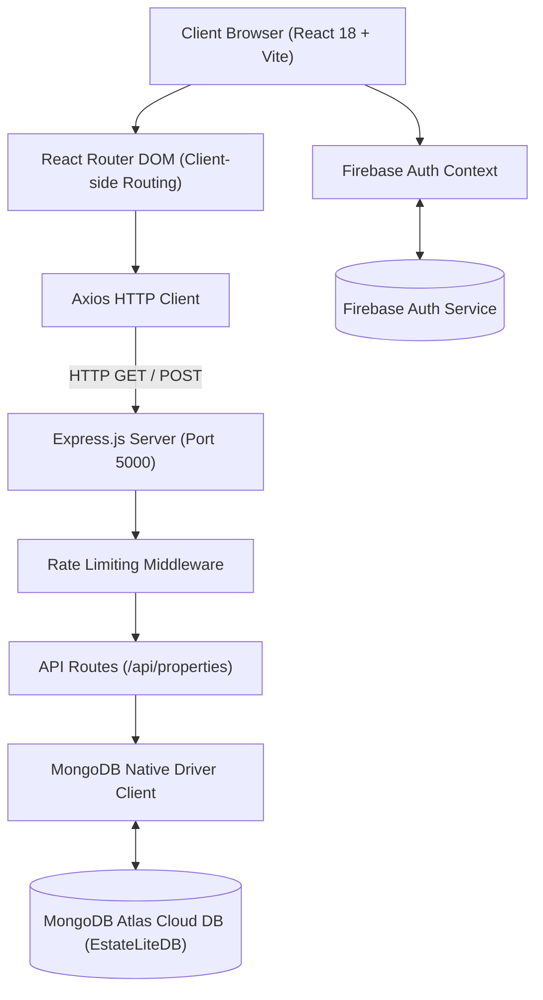

# Final Project Design Report — EstateLite

---

## 1. Cover Page

* **Project Title:** EstateLite — Real Estate Listing Platform MVP
* **Course:** Software Engineering Lab (Course Code: CSE 3206)
* **Academic Institution:** Department of Computer Science & Engineering
* **Submission Date:** August 16, 2026
* **Team Members:**
  * **Roll 131:** Backend Architecture & Database Design Lead
  * **Roll 130:** Frontend Engineering & Phase 1 Requirements Documentation Lead
  * **Roll 132:** Data Engineering, Process Model Documentation & Final Report Lead

---

## 2. Table of Contents

1. [Cover Page](#1-cover-page)
2. [Table of Contents](#2-table-of-contents)
3. [Project Overview](#3-project-overview)
4. [Problem Statement](#4-problem-statement)
5. [Stakeholder Identification](#5-stakeholder-identification)
6. [Project Scope](#6-project-scope)
7. [Functional Requirements](#7-functional-requirements)
8. [Non-Functional Requirements](#8-non-functional-requirements)
9. [User Stories](#9-user-stories)
10. [Assumptions and Constraints](#10-assumptions-and-constraints)
11. [Process Model Selection and Justification](#11-process-model-selection-and-justification)
12. [System Architecture Diagram](#12-system-architecture-diagram)
13. [Database Schema Table](#13-database-schema-table)
14. [API Documentation](#14-api-documentation)
15. [Screenshots of Working MVP](#15-screenshots-of-working-mvp)
16. [Conclusion and Future Work](#16-conclusion-and-future-work)

---

## 3. Project Overview

EstateLite is a Minimum Viable Product (MVP) web application built as a university Software Engineering lab project using the MERN technology stack (MongoDB native driver, Express.js, React, Node.js). The platform provides a streamlined interface for browsing and submitting real estate property listings across major areas in Dhaka (such as Gulshan, Banani, Dhanmondi, Uttara, and Bashundhara). By combining a React-based single-page application on the frontend with a RESTful Node.js/Express backend and a cloud-hosted MongoDB Atlas database, EstateLite demonstrates a functional end-to-end prototype of a modern real estate listing system.

The platform targets core real estate workflows: authenticated users can submit new property listings, while both authenticated and unauthenticated users can browse all available listings. The React frontend consumes REST endpoints via Axios, rendering properties in a clean, responsive layout built with TailwindCSS and DaisyUI.

---

## 4. Problem Statement

In Bangladesh, real estate information is fragmented across informal channels including social media groups, word-of-mouth referrals, and unstructured classified advertisements. Prospective buyers, renters, and property agents lack access to a centralized, reliable platform where property listings can be submitted, browsed, and searched in a structured format.

Furthermore, university students studying Software Engineering require practical exposure to full-stack web development workflows—including RESTful API design, Firebase authentication integration, frontend-backend communication, and cloud database management. EstateLite addresses both challenges: providing a functional prototype of a real estate listing platform while serving as an educational artifact demonstrating the MERN stack and software engineering process models.

---

## 5. Stakeholder Identification

| Stakeholder | Role | Interest & Expectations |
| :--- | :--- | :--- |
| **Property Browser (Guest User)** | End user | Ability to browse all property listings without account registration; view titles, prices, locations, and descriptions. |
| **Registered User (Submitter)** | End user | Ability to log in securely with email/password and submit new property listings directly into the database. |
| **Platform Administrator** | Operational | Ability to seed the database with sample data and manage Firebase user accounts. |
| **Software Engineering Instructor** | Academic evaluator | Verification that the project demonstrates a functioning MERN prototype, correct process model application, and thorough documentation. |
| **Development Team (Rolls 130, 131, 132)** | Software Engineers | Delivery of a working MVP meeting all functional and non-functional requirements within the semester timeline. |
| **MongoDB Atlas** | Infrastructure Provider | Cloud NoSQL database hosting the persistent property listings cluster. |
| **Firebase (Google)** | Authentication Provider | Managed email/password authentication service for secure user sessions. |

---

## 6. Project Scope

### 6.1 In Scope (MVP Features)
- **User Authentication:** Firebase email/password authentication with React Context session management.
- **Dashboard (Home Page):** Welcome banner, live property count API counter, and quick navigation cards.
- **Property Listing Module:** Responsive card grid fetching properties from `GET /api/properties` with client-side text search.
- **Property Submission Form:** Auth-gated form (`/add-property`) for submitting listings to `POST /api/properties`.
- **RESTful Backend API:** Express API handling GET and POST property operations connected to MongoDB Atlas native driver.
- **Database Seeding:** Automated script (`seed.js`) generating 12 realistic Dhaka property listings.

### 6.2 Out of Scope
- Image upload file hosting (stored as text URL references).
- Complex multi-field filter queries (beyond client-side title/location text matching).
- UPDATE (PUT) or DELETE operations.
- Native mobile app.

---

## 7. Functional Requirements

| ID | Requirement Description | Priority |
| :--- | :--- | :--- |
| **FR-01** | The system shall provide a login page where registered users authenticate using email and password via Firebase Auth. | High |
| **FR-02** | The system shall redirect authenticated users to the Dashboard and persist session state across page refreshes. | High |
| **FR-03** | The system shall display a Dashboard containing a welcome message, live API property count, and navigation cards. | High |
| **FR-04** | The system shall fetch property listings from `GET /api/properties` and render them on the Property Listing page. | High |
| **FR-05** | Property cards shall display property title, formatted price (BDT), location, bedrooms, and description. | High |
| **FR-06** | The system shall provide client-side real-time text searching by title and location on the Property Listing page. | Medium |
| **FR-07** | The system shall restrict access to `/add-property` to authenticated users, redirecting unauthenticated users to `/login`. | High |
| **FR-08** | The property form shall validate required fields before issuing `POST /api/properties`. | High |
| **FR-09** | The system shall communicate operation results via toast notifications. | Medium |
| **FR-10** | The system shall provide a sticky responsive navigation bar with Auth state indicators (Login/Logout). | High |

---

## 8. Non-Functional Requirements

| ID | Category | Requirement Description |
| :--- | :--- | :--- |
| **NFR-01** | Performance | Dashboard page shall load within 3 seconds on broadband connection. |
| **NFR-02** | Performance | REST API shall respond to `GET` and `POST` within 2 seconds under normal operation. |
| **NFR-03** | Usability | Application layout shall be fully responsive across 320px (mobile) to 1440px (desktop) viewports. |
| **NFR-04** | Usability | Form validation errors and toast notifications shall render within 500ms without page reloads. |
| **NFR-05** | Security | Credentials (Firebase keys, MongoDB URI) must be stored in `.env` environment files and omitted from version control. |
| **NFR-06** | Security | Private routes (`/add-property`) shall redirect unauthenticated users to `/login` with return paths preserved. |
| **NFR-07** | Reliability | Express backend shall enforce rate limiting of 100 requests per IP per 60-second window. |
| **NFR-08** | Maintainability | Frontend codebase shall follow modular structure (`src/components/`, `src/routes/`, `src/providers/`). |

---

## 9. User Stories

* **US-01 (Guest Browsing):** *As a* prospective buyer, *I want to* browse all listed properties without logging in, *so that* I can evaluate available real estate options.
* **US-02 (Authenticated Listing Submission):** *As a* real estate owner, *I want to* log in and submit a new property with details, *so that* it is instantly visible in the public gallery.
* **US-03 (Dashboard Orientation):** *As a* logged-in user, *I want to* land on a dashboard showing property statistics, *so that* I can easily navigate to my desired feature.
* **US-04 (Access Control Enforcement):** *As an* unauthenticated user attempting to access `/add-property`, *I want to* be redirected to `/login`, *so that* after logging in I am returned to the submission form.
* **US-05 (Error Recovery):** *As a* user submitting an incomplete property form, *I want to* receive immediate error feedback, *so that* I can correct the fields without losing typed data.

---

## 10. Assumptions and Constraints

### Assumptions
1. Active Firebase project with Email/Password authentication enabled.
2. Active MongoDB Atlas cluster with read/write database user permissions.
3. Node.js LTS installed locally with backend listening on port 5000.
4. Plain native MongoDB driver (`mongodb` npm package) utilized without ORM layer.

### Constraints
1. **Academic Timeline:** Completed within a single university semester lab course.
2. **Free-tier Limits:** Cloud database and authentication services operate on free-tier limits.
3. **No Mongoose:** Specification strictly mandates native MongoDB Node.js driver usage.
4. **Role Scope:** Work divided among Roll 130, Roll 131, and Roll 132.

---

## 11. Process Model Selection and Justification

The project selected the **Prototype Software Process Model**. Prototyping allowed the development team to rapidly build an early working version of the MERN application to evaluate client-server communication, database integration, and UI responsiveness.

Compared to **Waterfall**, Prototyping avoided rigid sequential phases and delivered early working software. Compared to **Agile Scrum**, Prototyping eliminated unnecessary sprint ceremony overhead for a short-term 3-person academic project.

---

## 12. System Architecture Diagram

---

## 13. Database Schema Table

### Collection: `properties` in Database `EstateLiteDB`

| Field Name | Data Type | Key Type | Description & Example |
| :--- | :--- | :--- | :--- |
| `_id` | `ObjectId` | Primary Key | Automatically generated MongoDB unique identifier |
| `title` | `String` | Required | Name of property listing (e.g., `"Luxury 3-Bedroom Apartment in South Gulshan"`) |
| `price` | `Number` | Required | Property price in BDT (e.g., `28500000`) |
| `location` | `String` | Required | Area in Dhaka (e.g., `"Gulshan"`, `"Banani"`, `"Dhanmondi"`) |
| `bedrooms` | `Number` | Optional | Number of bedrooms (`1` to `5`, `0` for commercial) |
| `description` | `String` | Required | Detailed description (2-3 sentences) |
| `addedBy` | `String` | Required | Email address of submitter (e.g., `"admin@estatelite.com"`) |
| `createdAt` | `String (ISO)` | System | ISO 8601 creation timestamp (e.g., `"2026-08-16T11:00:00.000Z"`) |

---

## 14. API Documentation

| Endpoint | Method | Purpose | Request Payload | Response (Success) |
| :--- | :--- | :--- | :--- | :--- |
| `/` | `GET` | Server Health Check | None | `200 OK` — `"EstateLite server is running"` |
| `/api/properties` | `GET` | Fetch all properties sorted by `createdAt: -1` | None | `200 OK` — Array of property objects |
| `/api/properties/:id` | `GET` | Fetch single property details by `_id` | None | `200 OK` — Single property object |
| `/api/properties` | `POST` | Insert a new property listing | `{ title, price, location, bedrooms, description, addedBy }` | `201 Created` — `{ message, insertedId, property }` |

---

## 15. Screenshots of Working MVP

The following application screenshots are located in `EstateLiteClient/screenshots/`:

1. **Dashboard Home Page (`dashboard.png`):** Displays hero banner, live property count badge, and feature navigation cards.
2. **Property Listing Gallery (`property-listing.png`):** Displays 12 mock Dhaka property cards with real-time text filter.
3. **Property Submission Form (`add-property.png`):** Authenticated form interface for adding new listings.
4. **Login Page (`login.png`):** Firebase authentication login interface.
5. **Mobile Responsive View (`mobile-view.png`):** Viewport demonstration of responsive navigation and layout on mobile devices.

---

## 16. Conclusion and Future Work

### Conclusion
The EstateLite MVP successfully demonstrates a fully functional real estate listing platform developed on the MERN stack adhering to the Prototype Process Model. All 10 Functional Requirements, 8 Non-Functional Requirements, and 5 User Stories specified in Phase 1 were successfully implemented, seeded with realistic data, and documented.

### Future Work
1. **Property Image Uploads:** Integration with Cloudinary or Firebase Storage for hosting multiple high-resolution property photos.
2. **Interactive Maps:** Integration with Google Maps API or Leaflet.js for interactive property location pinpoints.
3. **Advanced Filtering & Sorting:** Backend-driven search queries supporting price range sliders and location checkboxes.
4. **Property Update & Delete (CRUD Expansion):** Implementation of PUT and DELETE API endpoints with authorization policies.
